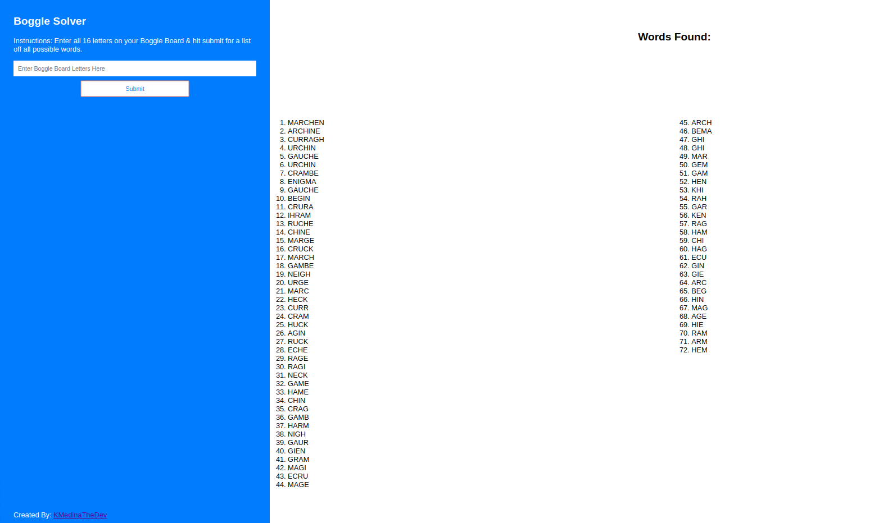

## Boggle Solver

*Description:*
 Create a web-based solver for Boggle. Users should be able to enter their Boggle "board" into a web page and retrieve a list of matching words.

*Issues:*
  - At the moment this app can only be used for 4x4 Boggle Boards. (API limitation)

## Solved Using:

1. JavaScript, HTML

## API used:

site: https://market.mashape.com/codebox/boggle
api url/endpoint: https://codebox-boggle-v1.p.mashape.com/{letters}
